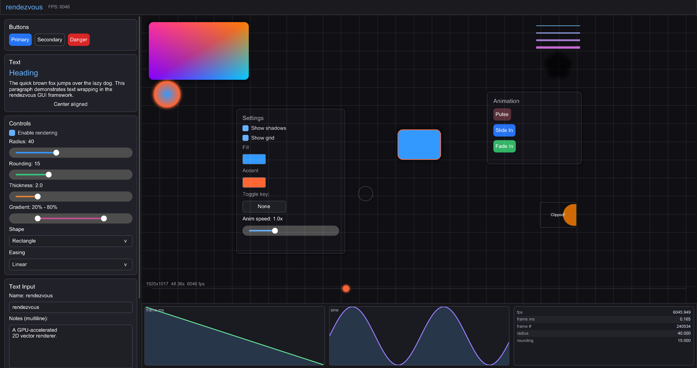
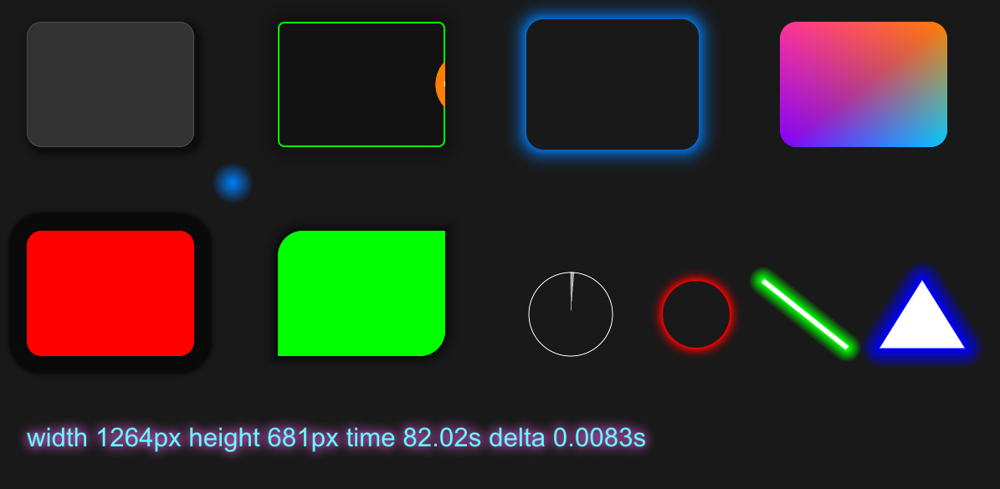

# rendezvous

Modern C++ 2D gui & rendering framework with abstracted STL & CRT. Has backends for DirectX11, OpenGL 2, and OpenGL3. There is both Windows and Linux examples included in `examples/`.

